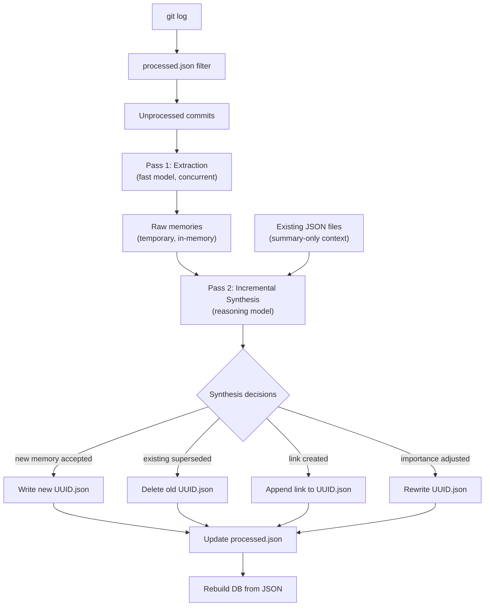

# JSON-First Memory Architecture

Transform the memory system so JSON files are the canonical store and SQLite is a disposable runtime cache.

## Problem

- SQLite DB is binary → can't git-merge across developers
- `last_commit` tracking breaks on rebases, cross-repo, parallel builds
- Multiple developers can't independently build memories

## Architecture

```
data/
  memories/                 ← git-tracked, one JSON per memory (UUID-named)
    a1b2c3d4.json           ← post-synthesis, finalized memory
    e5f6a7b8.json
  processed.json             ← git-tracked, sorted commit hashes
  project_memory.db         ← gitignored, runtime cache built from JSON
```

## Data Flow



## Key Design Decisions

| Decision | Choice | Why |
|----------|--------|-----|
| Memory IDs | UUID strings | Collision-proof across parallel devs |
| JSON files | Post-synthesis, finalized state | Always represent the clean, deduplicated corpus |
| Synthesis | Incremental: new × existing only | Existing memories already synthesized against each other |
| Links | Stored in each memory's JSON | Part of the finalized state — links are known relationships |
| Active/inactive | Inactive = JSON file deleted | Git tracks deletion, merge-safe |
| DB | Disposable runtime cache | Built from JSON on MCP startup if missing/stale |

## Incremental Synthesis

The key optimization: existing memories have already been synthesized against each other. Only new memories need comparison with the existing corpus.

**Current pass 2 prompt:**
> "Here are ALL 500 memories. Deduplicate, link, and deactivate."

**New incremental prompt:**
> "Here are 15 NEW memories. Here are the 350 EXISTING memories (summary + ID only, compact). For each new memory: does it supersede any existing? What links should be created?"

**What the synthesis returns:**
```json
{
  "accept": ["uuid-1", "uuid-3"],
  "reject": ["uuid-2"],
  "deactivate_existing": ["uuid-old-1"],
  "update_existing": [{"id": "uuid-old-2", "importance": 0.9}],
  "new_links": [
    {"source": "uuid-1", "target": "uuid-old-5", "relationship": "supersedes", "strength": 0.9}
  ]
}
```

**File system effects:**
- `accept` → write `data/memories/{uuid}.json`
- `reject` → discard (don't write JSON)
- `deactivate_existing` → delete `data/memories/{uuid}.json`
- `update_existing` → rewrite JSON file with updated fields
- `new_links` → append to the links array in each memory's JSON

## JSON Memory Format

```json
{
  "id": "a1b2c3d4-e5f6-7890-abcd-ef1234567890",
  "type": "decision",
  "summary": "Switched from categories to numeric confidence scores",
  "confidence": 78,
  "importance": 0.8,
  "source_commits": ["abc123def"],
  "file_paths": ["src/models.py", "src/build.py"],
  "tags": ["confidence", "scoring"],
  "created_at": "2026-03-12T22:00:00Z",
  "links": [
    {"target": "e5f6a7b8-...", "relationship": "supersedes", "strength": 0.9}
  ]
}
```

## Multi-Developer Scenarios

### Normal flow ✅
```
Dev A: builds, creates 50 JSON files + processed.json → push
Dev B: pulls, builds → processes only new commits → push
```

### Parallel builds ✅
```
Dev A: processes commits 51-55 → creates 5 JSONs (unique UUIDs)
Dev B: processes commits 56-60 → creates 5 JSONs (unique UUIDs)
Merge → 10 new files, no conflicts. processed.json auto-merges.
```

### Same commit processed by two devs ⚠️
```
Dev A: processes commit abc → creates uuid-A.json
Dev B: processes commit abc → creates uuid-B.json (different UUID!)
Merge → both exist. abc in processed.json (auto-merges, same line).
Next synthesis may deactivate one as a duplicate.
```

### Rebase ✅
```
Dev rebases → old commit hashes gone, new hashes created.
Old JSON files from pre-rebase commits are orphaned but harmless.
New commits get processed normally.
Optional: `prune` command cleans orphans.
```

---

## Proposed Changes

### Models

#### [MODIFY] [models.py](file:///home/eric/websites/codecide/dotai/.agent/memory/src/models.py)
- `Memory.id`: `Optional[int]` → `str` (UUID)
- Add `links: list[dict]` field (stored in JSON)
- Remove `updated_at`, `accessed_at`, `access_count` (DB-only runtime fields)
- Add `to_json()` / `from_json()` serialization methods
- `MemoryLink`: integer references → UUID strings

---

### JSON File I/O

#### [NEW] [json_store.py](file:///home/eric/websites/codecide/dotai/.agent/memory/src/json_store.py)
- `write_memory(memory, data_dir)` — writes `{uuid}.json`
- `delete_memory(uuid, data_dir)` — removes JSON file
- `read_all_memories(data_dir)` → list of Memory objects
- `read_processed(data_dir)` → set of commit hashes
- `add_processed(hashes, data_dir)` — append + sort
- `compute_fingerprint(data_dir)` — for stale DB detection

---

### Build

#### [MODIFY] [build.py](file:///home/eric/websites/codecide/dotai/.agent/memory/src/build.py)
- Replace `since_hash` logic with `processed.json` comparison
- Pass 1: extract → keep raw memories in memory (don't write to DB yet)
- Pass 2: incremental synthesis (new vs existing JSON corpus)
- After synthesis: write accepted JSON files, delete superseded ones
- Update processed.json with newly processed commit hashes
- Rebuild DB from all JSON files

#### [MODIFY] [prompts.py](file:///home/eric/websites/codecide/dotai/.agent/memory/src/prompts.py)
- Incremental synthesis prompt: takes new memories + existing summaries
- Schema: integer IDs → UUID strings
- Add `accept`/`reject` fields for new memory triage

---

### Database

#### [MODIFY] [db.py](file:///home/eric/websites/codecide/dotai/.agent/memory/src/db.py)
- Switch to WAL mode (no longer committed to git)
- Add `rebuild_from_json(data_dir)` method

#### [MODIFY] [stores.py](file:///home/eric/websites/codecide/dotai/.agent/memory/src/stores.py)
- `MemoryStore`: integer IDs → UUID-based lookups
- `touch()` / `access_count` remain as DB-only ephemeral features
- `BuildMetaStore`: simplified (no `last_commit`)

---

### Server

#### [MODIFY] [server.py](file:///home/eric/websites/codecide/dotai/.agent/memory/src/server.py)
- Startup: check DB freshness via fingerprint, rebuild from JSON if stale
- `recall_memory(memory_id: int)` → `recall_memory(memory_id: str)`

---

### Git Config

#### [MODIFY] [.gitignore](file:///home/eric/websites/codecide/dotai/.agent/memory/.gitignore)
- Gitignore `data/*.db` (currently allowed)
- Allow `data/memories/*.json` and `data/processed.json`


### Tests

All tests updated for UUID-based IDs, JSON file I/O, and incremental synthesis flow.

## Verification Plan

### Automated Tests
- JSON read/write round-trip
- processed.json prevents re-processing
- Incremental synthesis: new memories compared against existing only
- DB rebuild from JSON matches original data
- Stale DB detection + auto-rebuild

### Manual Testing
- Full build on dotai → JSON files created
- Incremental build → only new commits processed
- Kill mid-build → resume skips processed commits
- Delete DB → MCP auto-rebuilds from JSON
- Symlinked project (backbay) → separate data dir
